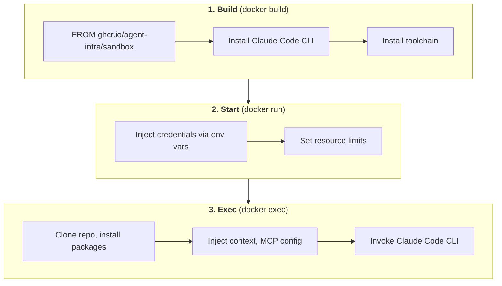

# Sandbox Solution Decisions

## Context

Decision on which sandbox solution to use for Dev Lab's Runtime Orchestrator.

**Related:** [Sandbox Solutions Survey](./20251226-architecture-sandbox-solutions.md) | [Architecture Backbone](./20251224-architecture-backbone.md)

---

## Decision: AIO Sandbox + Extend

### Why AIO Sandbox

| Requirement | AIO Sandbox |
|-------------|-------------|
| Display server for screenshots | VNC included |
| Browser for UI interaction | Chrome + CDP included |
| MCP servers | Pre-configured (browser, file, shell) |
| Extensible | Standard Dockerfile `FROM` |
| API for orchestrator | `/v1/*` endpoints |
| Maintenance burden | They maintain base image |

### Why Not Alternatives

| Alternative | Reason to Skip |
|-------------|----------------|
| Custom Dockerfile | Must build/maintain display, browser, MCP from scratch |
| Docker Official Sandbox | No display server, less customizable |
| claude-code-sandbox | No display server |
| Cloud solutions (E2B, Cloudflare) | Current constraint: no cloud sandbox |

---

## Provisioning Approach

Three-layer provisioning: **Build → Start → Exec**

See [Sandbox Testing](./20251228-architecture-sandbox-testing.md) for implementation details.



### Why Three Layers

| Layer | Mechanism | Why | What Belongs Here |
|-------|-----------|-----|-------------------|
| **1. Build** | `docker build` | Toolchain doesn't change per task | Claude Code, git, toolchain (node/python/etc) |
| **2. Start** | `docker run` | Creates isolation boundary; secrets can't be baked | Credentials, resource limits |
| **3. Exec** | `docker exec` | Only known when task is assigned | Clone repo, install packages, inject context, invoke agent |

### Separation Principle

- **Layer 1** = What's common to a *toolchain* (reusable across projects)
- **Layer 2** = What creates the *sandbox boundary* (isolation + secrets)
- **Layer 3** = What's *task-specific* (repo, branch, context, packages)

### Toolchain Images

Different projects need different toolchains. Build per-toolchain images:

| Image | Toolchain | Use Case |
|-------|-----------|----------|
| `devlab-sandbox:node` | node/npm | Frontend, Node.js projects |
| `devlab-sandbox:python` | python/uv | Backend, ML projects |
| `devlab-sandbox:fullstack` | node + python | Full-stack projects |

Orchestrator selects image based on repo requirements.

---

## Claude Code Integration

| Aspect | Decision |
|--------|----------|
| Where Claude Code runs | Inside AIO container |
| Native sandbox | Disabled (AIO provides isolation) |
| Tools | Claude Code's built-in (Read, Write, Edit, Bash, Glob, Grep) |
| Browser access | Playwright MCP or Chrome DevTools MCP |

**Not using AIO's MCP servers** - Claude Code's built-in tools are better integrated.

### CLI vs SDK Investigation

#### Available Options

| Option | Package | Description |
|--------|---------|-------------|
| **CLI** | `@anthropic-ai/claude-code` | Interactive terminal tool (npm) |
| **SDK (Python)** | `claude-agent-sdk` | Python wrapper with hooks/callbacks |
| **SDK (TypeScript)** | `@anthropic-ai/claude-code` | TypeScript SDK (same package as CLI) |

#### Key Finding: SDK Architecture

The Python SDK **bundles and spawns Claude Code CLI as a subprocess**:

```
claude-agent-sdk (Python)
    │
    │ spawns subprocess
    ▼
Claude Code CLI (bundled)
    │
    │ has built-in tools
    ▼
Read, Write, Edit, Bash, Glob, Grep
```

This means SDK and CLI have **identical capabilities** - SDK just adds a Python wrapper layer.

Source: [Claude Agent SDK docs](https://github.com/anthropics/claude-agent-sdk-python) - "The SDK operates by managing Claude Code as a subprocess through a CLI interface"

#### SDK Features

| Feature | Description |
|---------|-------------|
| `query()` | One-shot stateless queries |
| `ClaudeSDKClient` | Stateful multi-turn conversations |
| `@tool` decorator | Custom in-process MCP tools |
| Hooks | `PreToolUse`, `PostToolUse` callbacks |
| `can_use_tool` | Permission callback for security |
| Structured output | Typed messages (`AssistantMessage`, `ToolUseBlock`) |

#### Comparison for Dev Lab

| Factor | CLI | SDK |
|--------|-----|-----|
| **Invocation** | `docker exec claude -p "task"` | `docker exec python run_agent.py "task"` |
| **Output** | Text (parse stdout) | Structured JSON |
| **Simplicity** | Direct | Extra Python wrapper layer |
| **Dependencies** | npm only | npm + pip |
| **Hooks/Callbacks** | No | Yes (but inside container) |
| **Orchestrator language** | Any | Any (SDK runs in container) |

#### Current Leaning: CLI First (Pending Testing)

**Why CLI first:**
- Simpler - one less layer (SDK spawns CLI subprocess anyway)
- Orchestrator is outside container, SDK hooks are less useful
- Can add Python wrapper later if structured output needed

**When to reconsider SDK:**
- Need structured output parsing for orchestrator
- Want custom tools via `@tool` decorator
- Need permission callbacks inside agent

#### Architecture

```
┌─────────────────────────────────────────────────────────────┐
│                   AIO Sandbox Container                     │
│                                                             │
│  ┌───────────────────────────────────────────────────────┐  │
│  │  Claude Code CLI                                      │  │
│  │                                                       │  │
│  │  Built-in: Read, Write, Edit, Bash, Glob, Grep        │  │
│  │  + Playwright MCP (for browser)                       │  │
│  └───────────────────────────────────────────────────────┘  │
│                                                             │
│  AIO provides: isolation, VNC/display, Chrome              │
└─────────────────────────────────────────────────────────────┘
         ▲
         │ docker exec claude -p "task"
         │
┌─────────────────────────────────────────────────────────────┐
│                   Runtime Orchestrator                      │
└─────────────────────────────────────────────────────────────┘
```

---

## References

- [AIO Sandbox GitHub](https://github.com/agent-infra/sandbox)
- [AIO Sandbox Docs](https://sandbox.agent-infra.com/)
- [Claude Code Sandboxing](https://code.claude.com/docs/en/sandboxing)
